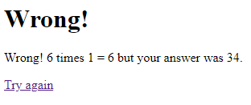

# To do (students): 
1. **Pull** this repository (or the latest changes) to your computer. 
3. Change the project in the following way:

* The **home.html** should show a multiplication question using two random whole numbers (integers). User types the answer to the text field and clicks the Submit button.

* In the templates rename **target.html** to **success.html** and add a third template **failure.html**.

* NOTE: Add a **Your Name** in a **p** element to all template pages.

* Modify **app.py**: after user clicks the Submit button it opens (*web.seeother(...)*) either **success.html** or **failure.html**, depending on the answer.

* See the images below to get an idea how the different views could look like. Be free to make it better!

* When everything works, **push** your work to the cloud.

4. Take 4 screenshots of your application (like below), save them to the **images** folder and link to the end of this document.

## Screenshots by teacher:

**home.html**:

**success.html**:

**failure.html** in case of an incorrect number:

**failure.html** in case of a bad input (not a number):

## Screenshots of your application:
Save the image files to **images** folder and use here links like above.