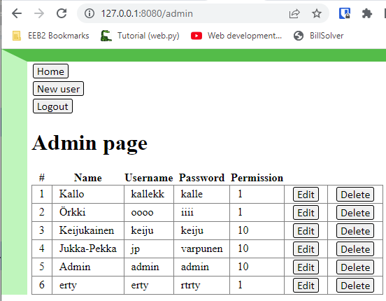

# To do (students): 
Implement **admin features** (*test each one* before going on):
1. Add a **Manage users link** to *home.html* and make the link only visible for admin users.

2. Add **Admin home page** (see picture below for an example) that shows all the users in a table (a new template *admin.html*, modify *app.py*: urls and a new class *Admin*)

3. Add a **New User** link and make it work (a new template *user_new.html*, modify *app.py*: urls and a new class *Admin_user_new*)

4. Add **Edit** and **Delete links** for each user.

5. **Make Edit user work** (add *user_edit.html*, modify *app.py*: urls and a new class *Admin_user_edit*)

6. **Make Delete user work** (add *user_delete.html*, modify *app.py*: urls and a new class *Admin_user_delete*)

7. **Secure admin features**: modify *app.py* so that only admin users can open the *admin.html* or do any changes there.

8. Plain text passwords are not very recommended.. So **hash the password** and make it work in all related features (login, signup, new user). Search the internet for details about hashing. The idea is to only save the hashed form of the password to the database. While logging in the password is hashed before the database query.

**Note:** this assignment partially replaces a **B test**. Each step counts for one point (if it works) -> max 8 points. A small test about this application will cover the rest (2-3 points). 

## Screenshots by teacher:

**admin.html**:

Note: if something does not work (despite your best efforts), add a comment about it below.

## Your screenshots and comments:
